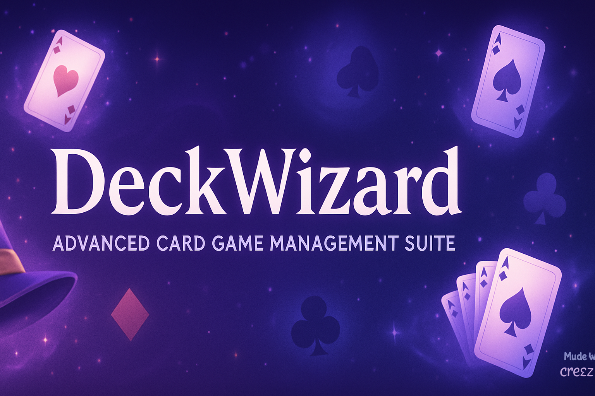

<div align="center">

# DeckWizard

**Advanced Card Game Management Suite**

[](https://github.com/ereezyy)
[](https://www.python.org/)
[](https://www.sqlite.org/)
[](LICENSE)
[](https://github.com/ereezyy/DeckWizard/releases)

*Master your card game collection with intelligent deck building and strategic analysis*

[🚀 Quick Start](#quick-start) • [🎮 Features](#features) • [📖 Documentation](#documentation) • [🔧 Installation](#installation) • [🎯 Usage](#usage)

</div>

---

## 🎯 Overview

DeckWizard is a comprehensive card game management suite designed for serious players, collectors, and strategists. Whether you're building competitive decks, tracking your collection, or analyzing game performance, DeckWizard provides the tools you need to master your favorite card games.

## ✨ Key Features

### 🃏 **Advanced Card Management**
- Comprehensive card database with detailed attributes
- Flexible search and filtering system
- Collection tracking with condition monitoring
- Set management and rarity analysis
- Import/export capabilities for popular formats

### 🏗️ **Intelligent Deck Building**
- Format-aware deck construction
- Mana curve analysis and optimization
- Card synergy suggestions
- Deck validation and compliance checking
- Multiple deck format support

### 📊 **Strategic Analysis**
- Detailed deck composition analysis
- Mana curve visualization
- Card type distribution insights
- Rarity balance assessment
- Performance optimization recommendations

### 🎮 **Game Performance Tracking**
- Comprehensive game result logging
- Win rate calculation and trending
- Matchup analysis against different opponents
- Game length and turn tracking
- Historical performance data

### 📈 **Advanced Statistics**
- Deck performance metrics
- Meta-game analysis
- Trend identification
- Comparative deck analysis
- Export capabilities for further analysis

## 🛠️ Technology Stack

### **Core Platform**
- **Python 3.8+** - Modern, powerful programming language
- **SQLite 3** - Lightweight, embedded database
- **JSON** - Flexible data interchange format

### **Data Management**
- **SQLite Database** - Efficient local storage
- **Dataclasses** - Type-safe data structures
- **JSON Serialization** - Portable data format
- **Logging System** - Comprehensive activity tracking

### **Analysis Engine**
- **Statistical Analysis** - Performance metrics calculation
- **Trend Analysis** - Historical data processing
- **Recommendation System** - AI-powered suggestions
- **Validation Engine** - Format compliance checking

## 🚀 Quick Start

### Prerequisites

- **Python 3.8** or higher
- **SQLite 3** (usually included with Python)
- **Command-line interface** access

### Installation

1. **Clone the repository**
   ```bash
   git clone https://github.com/ereezyy/DeckWizard.git
   cd DeckWizard
   ```

2. **Make the script executable**
   ```bash
   chmod +x deckwizard.py
   ```

3. **Run the demo**
   ```bash
   python deckwizard.py demo
   ```

4. **Start managing your cards**
   ```bash
   python deckwizard.py card add --name "Lightning Bolt" --cost 1 --type "Instant" --rarity "Common" --set "Core Set"
   ```

## 🎮 Usage Examples

### Card Management

#### **Add Cards to Database**
```bash
# Add a creature card
python deckwizard.py card add \
  --name "Dragon Lord" \
  --cost 8 \
  --type "Creature" \
  --rarity "Legendary" \
  --set "Core Set" \
  --description "Flying, powerful dragon" \
  --attack 8 \
  --health 8

# Add a spell card
python deckwizard.py card add \
  --name "Fire Bolt" \
  --cost 1 \
  --type "Spell" \
  --rarity "Common" \
  --set "Core Set" \
  --description "Deal 3 damage to any target"
```

#### **Search Your Collection**
```bash
# Search by name
python deckwizard.py card search --name "Dragon"

# Search by type and rarity
python deckwizard.py card search --type "Creature" --rarity "Legendary"

# Search by mana cost
python deckwizard.py card search --cost 1
```

### Deck Building

#### **Create and Manage Decks**
```bash
# Create a new deck
python deckwizard.py deck create --name "Aggro Red" --format "Standard"

# Analyze deck composition
python deckwizard.py deck analyze --id deck_20241221_143022
```

### Game Tracking

#### **Record Game Results**
```bash
# Record a victory
python deckwizard.py game record \
  --deck-id deck_20241221_143022 \
  --opponent "Control Blue" \
  --result win \
  --length 12 \
  --notes "Great opening hand, curved out perfectly"

# Record a loss
python deckwizard.py game record \
  --deck-id deck_20241221_143022 \
  --opponent "Midrange Green" \
  --result loss \
  --length 18 \
  --notes "Mana flooded, couldn't find threats"
```

#### **View Performance Statistics**
```bash
# Get comprehensive deck statistics
python deckwizard.py game stats --deck-id deck_20241221_143022
```

## 📁 Project Structure

```
DeckWizard/
├── 📄 README.md                    # Project documentation
├── 📄 LICENSE                      # Public domain license
├── 📄 deckwizard.py                # Main application script
├── 📄 deckwizard.log               # Application log file
├── 📄 deckwizard.db                # SQLite database (created on first run)
├── 📁 docs/                        # Additional documentation
├── 📁 examples/                    # Usage examples and tutorials
├── 📁 exports/                     # Exported data and reports
└── 📁 imports/                     # Card data import files
```

## 🔧 Advanced Configuration

### Database Schema

DeckWizard uses a SQLite database with the following structure:

```sql
-- Cards table: Master card database
CREATE TABLE cards (
    id TEXT PRIMARY KEY,
    name TEXT NOT NULL,
    cost INTEGER NOT NULL,
    card_type TEXT NOT NULL,
    rarity TEXT NOT NULL,
    set_name TEXT NOT NULL,
    description TEXT,
    attack INTEGER,
    health INTEGER,
    abilities TEXT  -- JSON array
);

-- Collection table: Owned cards
CREATE TABLE collection (
    card_id TEXT,
    quantity INTEGER DEFAULT 1,
    condition TEXT DEFAULT 'mint',
    acquired_date TEXT,
    FOREIGN KEY (card_id) REFERENCES cards (id)
);

-- Decks table: Deck configurations
CREATE TABLE decks (
    id TEXT PRIMARY KEY,
    name TEXT NOT NULL,
    format TEXT NOT NULL,
    cards TEXT,  -- JSON object {card_id: quantity}
    created_date TEXT,
    last_modified TEXT,
    win_rate REAL DEFAULT 0.0,
    games_played INTEGER DEFAULT 0
);

-- Game results table: Performance tracking
CREATE TABLE game_results (
    id TEXT PRIMARY KEY,
    deck_id TEXT,
    opponent_deck TEXT,
    result TEXT,  -- 'win', 'loss', 'draw'
    game_length INTEGER,
    date_played TEXT,
    notes TEXT,
    FOREIGN KEY (deck_id) REFERENCES decks (id)
);
```

### Card Data Format

Cards are represented with the following structure:

```python
@dataclass
class Card:
    id: str                    # Unique identifier
    name: str                  # Display name
    cost: int                  # Mana/resource cost
    card_type: str             # Type (Creature, Spell, etc.)
    rarity: str                # Rarity (Common, Rare, etc.)
    set_name: str              # Set/expansion name
    description: str           # Card text/description
    attack: Optional[int]      # Attack value (creatures)
    health: Optional[int]      # Health/toughness (creatures)
    abilities: List[str]       # Special abilities
```

### Deck Analysis Metrics

DeckWizard provides comprehensive deck analysis:

```python
analysis = {
    'total_cards': 60,                    # Total deck size
    'mana_curve': {1: 8, 2: 12, 3: 15},  # Cost distribution
    'card_types': {                       # Type breakdown
        'Creature': 24,
        'Spell': 20,
        'Land': 16
    },
    'rarities': {                         # Rarity distribution
        'Common': 40,
        'Uncommon': 15,
        'Rare': 4,
        'Legendary': 1
    },
    'recommendations': [                  # AI suggestions
        "Consider adding more low-cost cards",
        "Deck composition looks balanced"
    ]
}
```

## 📊 Performance Analytics

### Win Rate Tracking

DeckWizard automatically calculates and tracks:

- **Overall win rate** across all games
- **Matchup-specific** win rates against different opponents
- **Trend analysis** showing performance over time
- **Game length correlation** with win probability

### Statistical Insights

```bash
# Example statistics output
📈 Statistics for deck: Aggro Red
Games played: 25
Win rate: 68.0%
Wins: 17, Losses: 7, Draws: 1
Average game length: 8.4 turns

Recent performance:
✅ Win vs Control Blue (6 turns)
❌ Loss vs Midrange Green (14 turns)
✅ Win vs Aggro White (5 turns)
```

## 🎯 Supported Game Formats

DeckWizard is designed to work with various card game formats:

### **Magic: The Gathering**
- Standard, Modern, Legacy, Vintage
- Commander/EDH (100-card singleton)
- Limited formats (Draft, Sealed)

### **Hearthstone**
- Standard, Wild
- Arena drafts
- Battlegrounds compositions

### **Pokémon TCG**
- Standard, Expanded
- Theme deck analysis
- Tournament formats

### **Custom Games**
- User-defined formats
- Flexible deck size limits
- Custom card types and rarities

## 🔍 Advanced Features

### Deck Optimization

```python
# Automatic deck optimization suggestions
suggestions = deck_manager.suggest_cards(deck, count=5)
for card in suggestions:
    print(f"Consider adding: {card.name} ({card.cost} cost)")
```

### Meta-Game Analysis

```python
# Track popular cards and strategies
meta_analysis = {
    'popular_cards': ['Lightning Bolt', 'Counterspell'],
    'trending_strategies': ['Aggro', 'Control'],
    'format_diversity': 0.85  # Shannon diversity index
}
```

### Import/Export Capabilities

```bash
# Export deck to various formats
python deckwizard.py deck export --id deck_123 --format mtgo
python deckwizard.py deck export --id deck_123 --format arena

# Import from popular deck sites
python deckwizard.py deck import --file "deck_list.txt" --format mtgtop8
```

## 🚀 Deployment & Integration

### Standalone Usage

```bash
# Run as a standalone application
python deckwizard.py demo
python deckwizard.py card search --name "Lightning"
```

### Integration with Other Tools

```python
# Use as a Python library
from deckwizard import CardDatabase, DeckManager

db = CardDatabase()
manager = DeckManager()

# Programmatic deck building
deck = manager.create_deck("My Deck", "Standard")
manager.add_card_to_deck(deck, "lightning_bolt", 4)
```

### Web Interface (Future Enhancement)

```python
# Planned web interface using Flask
from flask import Flask, render_template
from deckwizard import DeckWizardCLI

app = Flask(__name__)
wizard = DeckWizardCLI()

@app.route('/decks')
def list_decks():
    # Web interface for deck management
    pass
```

## 🤝 Contributing

We welcome contributions to make DeckWizard even better!

### **Development Areas**
- 🃏 **New card game support** (Yu-Gi-Oh!, Legends of Runeterra)
- 📊 **Advanced analytics** (machine learning predictions)
- 🌐 **Web interface** development
- 📱 **Mobile app** integration
- 🔄 **API integrations** with popular card databases

### **How to Contribute**
1. **Fork** the repository
2. **Create** a feature branch (`git checkout -b feature/amazing-feature`)
3. **Commit** your changes (`git commit -m 'Add amazing feature'`)
4. **Push** to the branch (`git push origin feature/amazing-feature`)
5. **Open** a Pull Request

## 📄 License

This project is released into the **Public Domain**. You are free to use, modify, and distribute this software for any purpose, commercial or non-commercial.

## 🙏 Acknowledgments

- **Card game communities** for inspiration and feedback
- **Python community** for excellent libraries and tools
- **SQLite team** for the reliable database engine
- **Open source contributors** who make projects like this possible

## 📞 Support & Resources

### **Documentation**
- 📖 [Full Documentation](https://github.com/ereezyy/DeckWizard/wiki)
- 🎥 [Video Tutorials](https://github.com/ereezyy/DeckWizard/wiki/tutorials)
- 📋 [FAQ](https://github.com/ereezyy/DeckWizard/wiki/faq)

### **Community**
- 💬 [GitHub Discussions](https://github.com/ereezyy/DeckWizard/discussions)
- 🐛 [Issue Tracker](https://github.com/ereezyy/DeckWizard/issues)
- 📧 [Contact Developer](mailto:ereezyy@github.com)

### **Professional Services**
- 🏢 **Custom development** for specific card games
- 📊 **Advanced analytics** implementation
- 🔧 **Integration services** with existing tools

---

<div align="center">

**Made with 🎮 by [ereezyy](https://github.com/ereezyy)**

*Master the art of deck building with intelligent card game management*

[](https://github.com/ereezyy/DeckWizard/stargazers)
[](https://github.com/ereezyy/DeckWizard/network/members)

</div>

